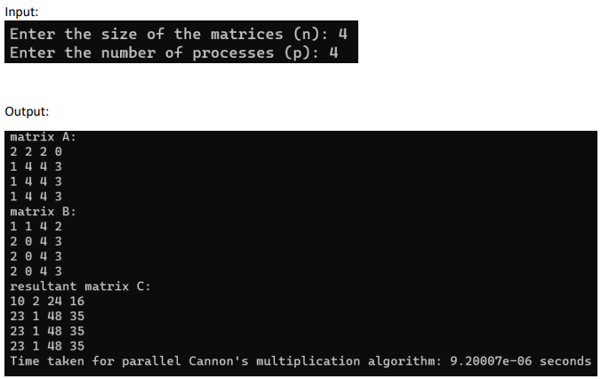
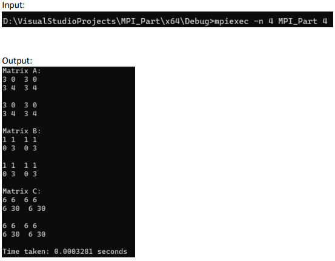

# Parallel_Cannon_Algorithm
CSE455 High Performance Computing Course Project

## OpenMP
1. Build the OpenMP_ProjectTrial.cpp and run the OpenMP_ProjectTrial.exe
2. Enter the size of matrices (n) and the number of processes (p)
   
See the Execution Sample below:

## MPI
1. Build the MPI_Part.cpp and open the command prompt in the same folder that has the MPI_Part.exe
2. Run the following command `mpiexec -n <num_processes> MPI_Part <matrix_size>`

See the Execution Sample below:

